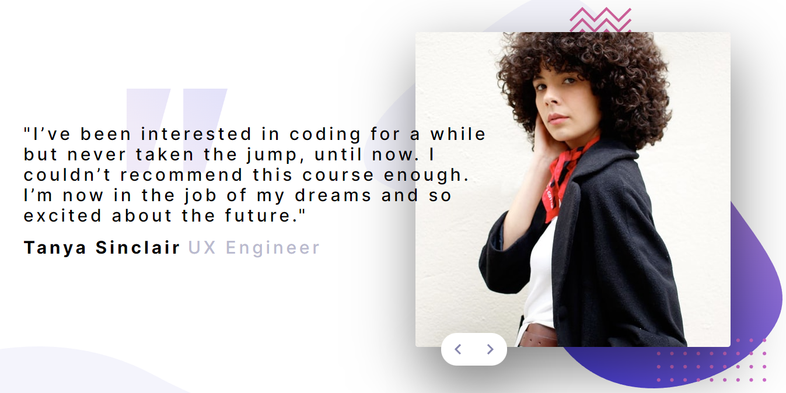

# Frontend Mentor - Coding bootcamp testimonials slider solution

This is a solution to the [Coding bootcamp testimonials slider challenge on Frontend Mentor](https://www.frontendmentor.io/challenges/coding-bootcamp-testimonials-slider-4FNyLA8JL). Frontend Mentor challenges help you improve your coding skills by building realistic projects. 

## Table of contents

- [Overview](#overview)
  - [The challenge](#the-challenge)
  - [Screenshot](#screenshot)
  - [Links](#links)
- [My process](#my-process)
  - [Built with](#built-with)
  - [What I learned](#what-i-learned)
  - [Continued development](#continued-development)
  - [Useful resources](#useful-resources)
- [Author](#author)
- [Acknowledgments](#acknowledgments)

## Overview

### The challenge

Users should be able to:

- View the optimal layout for the component depending on their device's screen size
- Navigate the slider using either their mouse/trackpad or keyboard

### Screenshot




### Links

- Solution URL: [https://github.com/BMcdavitt/femCodeBootcampTestimonials](https://github.com/BMcdavitt/femCodeBootcampTestimonials)
- Live Site URL: [https://bmcdavitt.github.io/femCodeBootcampTestimonials/](https://bmcdavitt.github.io/femCodeBootcampTestimonials/)

## My process

### Built with

- Semantic HTML5 markup
- CSS custom properties
- Flexbox
- CSS Grid
- Mobile-first workflow

### What I learned

I added an animation when changing the phtos.  Best way I found to reset the animation is this:

```js
function flipPhoto() {
  const photoDivs = document.getElementsByClassName('profilePhoto')

  Array.from(photoDivs).forEach((value) => {
    value.classList.remove('animatePhoto')
    void value.offsetWidth
    value.classList.add('animatePhoto')
  })
}
```


## Author

- Website - [Bill McDavitt](https://bmcdavitt.github.io/homepage/)
- Frontend Mentor - [@BMcdavitt](https://www.frontendmentor.io/profile/BMcdavitt)
- Twitter - [@bill_mcdavitt](https://twitter.com/bill_mcdavitt)
